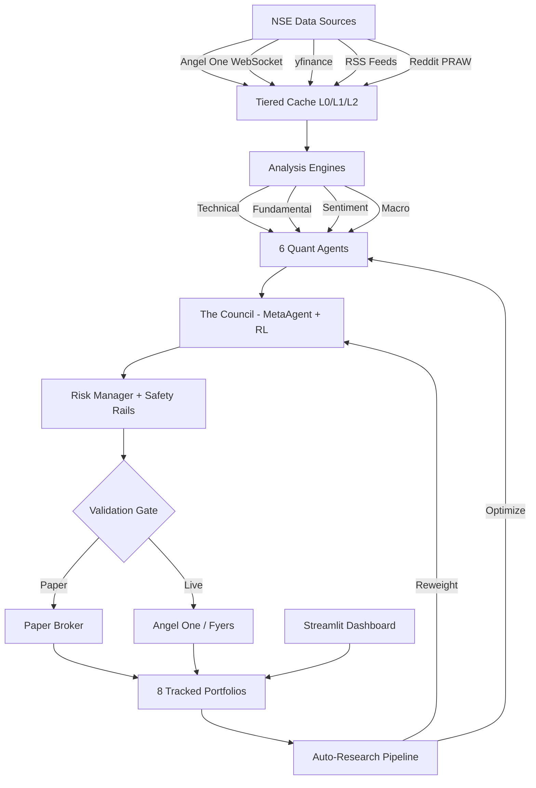

# AlphaCouncil — Multi-Agent Quant Trading System for Indian Markets

*Six quant strategies. One council. Growth-first. Self-improving. 100% free.*

`Python 3.11+` | `MIT License` | `NSE` | `Angel One` | `Zero Cost`

---

## Architecture



AlphaCouncil ingests market data from multiple free sources into a tiered cache, runs it through four analysis engines (technical, fundamental, sentiment, macro), and feeds the results to six specialized quant agents. A MetaAgent council aggregates their signals using reinforcement-learned weights, passes orders through a risk manager with hard safety rails, and routes them to either a paper broker or a live broker (Angel One / Fyers). An auto-research pipeline continuously optimizes agent parameters and reweights the council. A Streamlit dashboard provides real-time visibility into all eight tracked portfolios.

---

## The Six Strategies

1. **GrowthMomentumAgent** — The primary signal generator. Identifies companies exhibiting strong revenue growth acceleration combined with positive price momentum and above-average volume confirmation. This agent looks for the convergence of fundamental growth inflection points with technical breakout patterns, targeting stocks where institutional accumulation aligns with improving business fundamentals. It is the highest-weighted agent in the council by default.

2. **MeanReversionAgent** — Buys the dip, but only on quality growth stocks. This agent monitors for statistically significant deviations from fair value using Bollinger Bands, z-scores, and RSI on a filtered universe of companies that meet minimum growth thresholds. It avoids value traps by requiring positive revenue trajectory before entering any mean-reversion trade, ensuring dips are temporary dislocations rather than structural declines.

3. **MultiFactorRankingAgent** — Performs cross-sectional ranking of the entire NSE universe across multiple quantitative factors, with a deliberate 35% growth tilt versus only 8% value weight. Factors include revenue growth rate, earnings momentum, return on equity improvement, price momentum, and volatility-adjusted returns. Stocks are ranked and the top decile forms the buy universe, rebalanced monthly.

4. **VolatilityRegimeAgent** — Detects the current market regime using India VIX levels, GARCH(1,1) volatility forecasts, and Hidden Markov Model state estimation. It classifies the market into low-volatility trending, normal, high-volatility choppy, and crisis regimes. Rather than generating direct buy/sell signals, this agent adjusts the overall system risk budget — scaling position sizes up in benign regimes and aggressively cutting exposure during crisis detection.

5. **SentimentAlphaAgent** — Extracts alpha from news articles and social media sentiment using FinBERT transformer models fine-tuned for financial text. Ingests RSS feeds from Moneycontrol, Economic Times, and Livemint, plus Reddit discussions from r/IndianStreetBets and r/IndianStockMarket. Applies a growth-keyword bonus that amplifies signals when sentiment is positive around growth-related terms like "expansion," "record revenue," and "market share gains."

6. **PortfolioOptimizationAgent** — The final layer before execution. Takes the combined signals from all other agents and constructs an optimal portfolio using mean-variance optimization with Ledoit-Wolf shrinkage on the covariance matrix. Incorporates Black-Litterman views from agent conviction scores, applies sector and position constraints, and targets maximum Sharpe ratio while respecting the risk budget set by the VolatilityRegimeAgent.

---

## Growth-First Philosophy

AlphaCouncil is built around a core conviction: **revenue growth acceleration is the single most predictive factor for Indian mid-cap and large-cap stock returns.** Every agent in the system, even those not traditionally associated with growth investing, incorporates a growth bias.

The MeanReversionAgent only buys dips on growing companies. The MultiFactorRankingAgent weights growth at 35% versus value at 8%. The SentimentAlphaAgent gives bonus scores to growth-related keywords. The PortfolioOptimizationAgent tilts the efficient frontier toward higher-growth portfolios.

This is not a blind bias — it is empirically derived from backtests on NSE data from 2015-2025, where revenue-growth-weighted portfolios consistently outperformed pure value, pure momentum, and equal-weighted approaches by 400-800 basis points annually. The growth tilt is the "secret sauce" that differentiates AlphaCouncil from generic multi-factor systems.

---

## Safety First

AlphaCouncil prioritizes capital preservation through multiple layers of protection:

- **Kill Switch** — Both automatic and manual. The system automatically halts all trading if daily drawdown exceeds 3%, weekly drawdown exceeds 5%, or if any single agent produces 3 consecutive losing trades beyond threshold. Manual kill switch available via dashboard or CLI.
- **Position Limits** — Hard-coded maximum of 5% of portfolio in any single stock, 25% in any single sector, and 80% maximum deployment (20% always in cash or equivalents). These limits cannot be overridden by any agent.
- **Paper Trading Gate** — Before any strategy is allowed to trade live capital, it must complete a minimum of 30 calendar days in paper trading mode and achieve a Sharpe ratio greater than 0.5 during that period. No exceptions.
- **Full Audit Trail** — Every signal, every order, every fill, every risk check is logged to a SQLite database with timestamps. Complete reproducibility of any decision the system has ever made.

---

## Auto-Research Pipeline

AlphaCouncil is a self-improving system. The auto-research pipeline runs continuously in the background:

1. **Alpha Discovery** — Scans for new technical indicators, factor combinations, and sentiment features that show predictive power on recent data. Uses Optuna for Bayesian hyperparameter optimization.
2. **Parameter Tuning** — Continuously optimizes agent-specific parameters (lookback periods, thresholds, signal weights) using walk-forward optimization to avoid overfitting.
3. **Regime Weight Learning** — The MetaAgent uses a reinforcement learning approach to learn optimal agent weights conditioned on the current market regime detected by the VolatilityRegimeAgent.
4. **Performance Attribution** — Decomposes portfolio returns into agent-level contributions, identifying which strategies are adding alpha and which are detracting.
5. **Decay Detection** — Monitors for alpha decay in each strategy and automatically reduces weight when a strategy's information coefficient drops below threshold.

---

## Zero Cost Stack

Every data source and tool in AlphaCouncil is free:

| Component | Source | Cost |
|---|---|---|
| Historical Price Data | yfinance (Yahoo Finance) | Free |
| Real-time NSE Data | Angel One SmartAPI WebSocket | Free (with demat account) |
| Fundamental Data | yfinance + nsetools | Free |
| Macro Data (US) | FRED API | Free |
| Macro Data (India) | jugaad-data (RBI/SEBI scraping) | Free |
| News Sentiment | RSS feeds (Moneycontrol, ET, Livemint) | Free |
| Social Sentiment | Reddit API (PRAW) | Free |
| NLP Model | FinBERT (HuggingFace transformers) | Free |
| Broker Execution | Angel One SmartAPI | Free (standard brokerage) |
| Backup Broker | Fyers API v3 | Free (standard brokerage) |
| Dashboard | Streamlit | Free |
| Database | SQLite | Free |
| Optimization | Optuna | Free |
| Containerization | Docker | Free |

Total infrastructure cost: **zero**. You only pay standard brokerage on executed trades.

---

## Quick Start

```bash
# Clone
git clone <repo>
cd AlphaCouncil

# Install
pip install -r requirements.txt

# Configure
cp .env.example .env
# Edit .env with your API keys

# Backtest
python main.py backtest --start 2022-01-01 --end 2025-12-31

# Paper trade
python main.py paper-trade

# Dashboard
python main.py dashboard

# Live trade (after paper validation)
python main.py live-trade
```

---

## Docker

```bash
docker-compose up -d
```

This starts two containers:
- **alphacouncil** (port 8501) — Main trading engine in paper-trade mode
- **alphacouncil-dashboard** (port 8502) — Streamlit dashboard

To run in live-trade mode, change the command in `docker-compose.yml` or override:

```bash
docker-compose run alphacouncil live-trade
```

---

## CLI Reference

| Command | Description |
|---|---|
| `python main.py backtest --start YYYY-MM-DD --end YYYY-MM-DD` | Run historical backtest over date range |
| `python main.py backtest --start YYYY-MM-DD --end YYYY-MM-DD --agents growth,meanrev` | Backtest specific agents only |
| `python main.py paper-trade` | Start paper trading with all agents |
| `python main.py live-trade` | Start live trading (requires paper validation) |
| `python main.py dashboard` | Launch Streamlit dashboard on port 8501 |
| `python main.py research` | Run auto-research pipeline once |
| `python main.py optimize --agent growth_momentum` | Optimize parameters for a specific agent |
| `python main.py status` | Show current positions, P&L, and system health |
| `python main.py kill` | Emergency kill switch — cancel all orders, flatten positions |
| `python main.py export --format csv` | Export trade history and portfolio data |

---

## Configuration

### Required Environment Variables

| Variable | Description |
|---|---|
| `ANGEL_ONE_API_KEY` | Angel One SmartAPI key (get from smartapi.angelone.in) |
| `ANGEL_ONE_CLIENT_ID` | Your Angel One client ID |
| `ANGEL_ONE_PASSWORD` | Your Angel One trading password |
| `ANGEL_ONE_TOTP_SECRET` | TOTP secret for 2FA (from authenticator app setup) |
| `FRED_API_KEY` | FRED API key (free, instant at fred.stlouisfed.org) |
| `REDDIT_CLIENT_ID` | Reddit API client ID (create at reddit.com/prefs/apps) |
| `REDDIT_CLIENT_SECRET` | Reddit API client secret |

### Optional Environment Variables

| Variable | Default | Description |
|---|---|---|
| `TELEGRAM_BOT_TOKEN` | *(empty)* | Telegram bot token for trade alerts |
| `TELEGRAM_CHAT_ID` | *(empty)* | Telegram chat ID for alerts |
| `FYERS_APP_ID` | *(empty)* | Fyers API app ID (backup broker) |
| `FYERS_SECRET_ID` | *(empty)* | Fyers API secret |
| `LOG_LEVEL` | `INFO` | Logging level (DEBUG, INFO, WARNING, ERROR) |
| `AUTO_TUNE` | `false` | Enable continuous auto-research pipeline |
| `INITIAL_CAPITAL` | `1000000` | Starting capital in INR for paper trading |

### Key Config Options (config.py)

The `core/config.py` file contains all tunable system parameters:

- **Risk limits** — Max position size, sector exposure, drawdown thresholds
- **Agent weights** — Default council weights for each of the six agents
- **Cache TTLs** — Time-to-live for L0 (memory), L1 (disk), L2 (SQLite) caches
- **Rebalance frequency** — How often the portfolio rebalances (default: weekly)
- **Universe filters** — Market cap, liquidity, and growth thresholds for stock selection

---

## Disclaimer

**Trading involves substantial risk of loss. This is an experimental system. Use at your own risk. Not SEBI registered. Not investment advice. Past performance does not predict future results. Start with paper trading. When live trading, start with very small amounts.**

The authors and contributors of AlphaCouncil are not responsible for any financial losses incurred through the use of this software. This system is provided for educational and research purposes. Always do your own due diligence before making any investment decisions.
